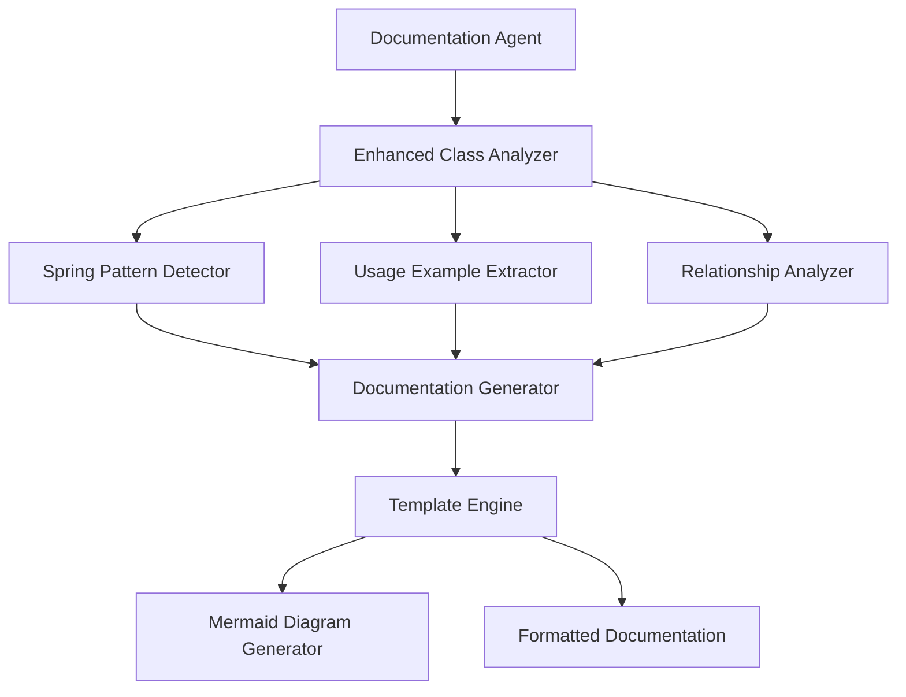

# Enhanced Class Documentation Design

## Overview

This design document outlines the architecture and implementation approach for enhancing the existing class documentation generation system. The enhancement will provide comprehensive, Spring-focused documentation with real codebase usage examples and adaptive content length.

## Architecture

### High-Level Architecture



### Component Integration

The enhanced class documentation will integrate with existing components:

- **Documentation Agent**: Enhanced with new analysis capabilities
- **RAG Service**: Extended to find real usage examples in codebase
- **Java Parser**: Enhanced to detect Spring patterns and annotations
- **Main View Provider**: Already supports Mermaid diagrams (recently added)

## Components and Interfaces

### 1. Enhanced Class Analyzer

**Purpose**: Analyzes Java classes with Spring-specific intelligence

**Interface**:
```typescript
interface EnhancedClassAnalyzer {
    analyzeClass(javaClass: JavaClass, projectStructure: ProjectStructure): ClassAnalysis;
    determineComplexityLevel(javaClass: JavaClass): ComplexityLevel;
    extractSpringPatterns(javaClass: JavaClass): SpringPattern[];
}

interface ClassAnalysis {
    basicInfo: ClassInfo;
    springPatterns: SpringPattern[];
    complexityLevel: ComplexityLevel;
    relationships: ClassRelationship[];
    methodAnalysis: MethodAnalysis[];
}

enum ComplexityLevel {
    SIMPLE = "simple",      // 1-5 methods, 200-400 words
    MODERATE = "moderate",  // 6-15 methods, 400-800 words
    COMPLEX = "complex"     // 16+ methods, 800-1500 words
}
```

### 2. Spring Pattern Detector

**Purpose**: Identifies and explains Spring-specific patterns and annotations

**Interface**:
```typescript
interface SpringPatternDetector {
    detectPatterns(javaClass: JavaClass): SpringPattern[];
    explainPattern(pattern: SpringPattern): PatternExplanation;
    getSpringAnnotations(javaClass: JavaClass): SpringAnnotation[];
}

interface SpringPattern {
    type: 'MVC_CONTROLLER' | 'SERVICE_LAYER' | 'REPOSITORY' | 'CONFIGURATION' | 'COMPONENT';
    annotations: string[];
    explanation: string;
    bestPractices: string[];
}
```

### 3. Usage Example Extractor

**Purpose**: Finds real usage examples from the codebase using enhanced RAG

**Interface**:
```typescript
interface UsageExampleExtractor {
    findMethodUsages(className: string, methodName: string, projectStructure: ProjectStructure): UsageExample[];
    findClassInstantiation(className: string, projectStructure: ProjectStructure): InstantiationExample[];
    generateRealisticExamples(method: Method, springContext: SpringPattern[]): CodeExample[];
}

interface UsageExample {
    sourceFile: string;
    context: string;
    codeSnippet: string;
    explanation: string;
}
```

### 4. Relationship Analyzer

**Purpose**: Analyzes class relationships and dependencies with Spring context

**Interface**:
```typescript
interface RelationshipAnalyzer {
    analyzeRelationships(javaClass: JavaClass, projectStructure: ProjectStructure): ClassRelationship[];
    generateRelationshipDiagram(relationships: ClassRelationship[]): MermaidDiagram;
    identifySpringDependencies(javaClass: JavaClass): SpringDependency[];
}

interface ClassRelationship {
    type: 'DEPENDENCY_INJECTION' | 'INHERITANCE' | 'COMPOSITION' | 'ASSOCIATION';
    targetClass: string;
    springContext?: SpringAnnotation;
    explanation: string;
}
```

### 5. Enhanced Documentation Generator

**Purpose**: Generates comprehensive documentation using all analysis components

**Interface**:
```typescript
interface EnhancedDocumentationGenerator {
    generateDocumentation(analysis: ClassAnalysis, usageExamples: UsageExample[]): string;
    generateMethodDocumentation(method: Method, examples: UsageExample[]): string;
    generateSpringPatternExplanation(patterns: SpringPattern[]): string;
}
```

## Data Models

### Enhanced Class Analysis Model

```typescript
interface EnhancedClassInfo extends JavaClass {
    springAnnotations: SpringAnnotation[];
    springPatterns: SpringPattern[];
    complexityMetrics: ComplexityMetrics;
    realUsageExamples: UsageExample[];
    springDependencies: SpringDependency[];
}

interface ComplexityMetrics {
    methodCount: number;
    dependencyCount: number;
    annotationComplexity: number;
    overallComplexity: ComplexityLevel;
    recommendedDocLength: number;
}

interface SpringAnnotation {
    name: string;
    purpose: string;
    commonUsage: string;
    parameters?: { [key: string]: string };
}
```

### Documentation Template Model

```typescript
interface DocumentationTemplate {
    sections: DocumentationSection[];
    targetLength: number;
    complexityLevel: ComplexityLevel;
    includesDiagrams: boolean;
}

interface DocumentationSection {
    title: string;
    content: string;
    priority: number;
    requiredForComplexity: ComplexityLevel[];
}
```

## Error Handling

### Analysis Errors
- **Spring Pattern Detection Failures**: Fallback to generic Java patterns
- **Usage Example Extraction Failures**: Generate synthetic examples based on method signatures
- **Relationship Analysis Failures**: Use basic inheritance/composition relationships

### Documentation Generation Errors
- **Template Rendering Failures**: Use simplified template with core information
- **Mermaid Diagram Generation Failures**: Include textual relationship descriptions
- **Length Calculation Errors**: Default to moderate complexity documentation

### Integration Errors
- **RAG Service Unavailable**: Use cached examples or generate synthetic ones
- **Java Parser Failures**: Use basic class information without Spring context
- **File System Access Issues**: Generate documentation with available information

## Testing Strategy

### Unit Testing
1. **Spring Pattern Detection Tests**
   - Test detection of common Spring annotations
   - Test pattern explanation generation
   - Test edge cases with multiple patterns

2. **Usage Example Extraction Tests**
   - Test finding real method calls in sample codebases
   - Test synthetic example generation
   - Test example quality and relevance

3. **Documentation Generation Tests**
   - Test different complexity levels
   - Test Spring-specific content generation
   - Test template rendering with various inputs

### Integration Testing
1. **End-to-End Documentation Generation**
   - Test with real Spring Boot projects
   - Test with different class types (Controllers, Services, Repositories)
   - Test documentation quality and completeness

2. **RAG Integration Testing**
   - Test usage example extraction from large codebases
   - Test performance with complex project structures
   - Test accuracy of extracted examples

### Performance Testing
1. **Large Class Analysis**
   - Test with classes having 50+ methods
   - Test memory usage during analysis
   - Test generation time for complex classes

2. **Codebase Scanning Performance**
   - Test usage example extraction on large projects
   - Test concurrent analysis of multiple classes
   - Test caching effectiveness

## Implementation Phases

### Phase 1: Core Enhancement (Week 1-2)
- Enhance Documentation Agent with complexity detection
- Implement Spring Pattern Detector
- Update prompt templates for Spring-specific content
- Add adaptive length calculation

### Phase 2: Usage Example Integration (Week 2-3)
- Enhance RAG Service for usage example extraction
- Implement Usage Example Extractor
- Integrate real examples into documentation generation
- Add fallback synthetic example generation

### Phase 3: Relationship Analysis (Week 3-4)
- Implement Enhanced Relationship Analyzer
- Add Spring dependency detection
- Generate Mermaid diagrams for class relationships
- Integrate visual elements into documentation

### Phase 4: Quality & Polish (Week 4-5)
- Implement comprehensive error handling
- Add performance optimizations
- Enhance documentation templates
- Add extensive testing coverage

### Phase 5: Advanced Features (Week 5-6)
- Add troubleshooting sections
- Implement best practices suggestions
- Add configuration-aware documentation
- Optimize for different Spring Boot versions

## Performance Considerations

### Caching Strategy
- Cache Spring pattern analysis results
- Cache usage example extraction results
- Cache relationship analysis for frequently accessed classes

### Optimization Techniques
- Lazy loading of usage examples
- Parallel analysis of class relationships
- Incremental documentation updates
- Smart template selection based on complexity

### Resource Management
- Limit concurrent analysis operations
- Implement timeout mechanisms for long-running operations
- Use streaming for large documentation generation
- Optimize memory usage during codebase scanning