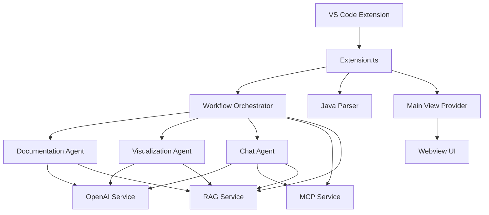

# CodeDoc Extension Description

## Overview

CodeDoc is a Visual Studio Code extension that leverages AI to generate documentation, create visualizations, and provide intelligent chat capabilities for Java projects. The extension uses Langchain agents with Retrieval-Augmented Generation (RAG) and Multi-Agent Communication Protocol (MCP) to provide context-aware responses and coordinate complex tasks.

## Architecture

The extension follows a modular architecture with the following key components:

1. **Agents** - Core AI-powered modules that perform specific tasks
2. **Services** - Supporting services for parsing, RAG, and OpenAI integration
3. **Views** - Webview provider for UI rendering
4. **Extension** - Main entry point that coordinates all components

### System Diagram

## Modules

### 1. Agents

The agents are the core intelligence of the extension, implemented using Langchain. Each agent is responsible for a specific domain:

#### Documentation Agent

**Location**: `src/agents/documentation_agent_langchain.ts`

**Purpose**: Generates comprehensive documentation for Java projects and classes.

**Key Features**:
- Project overview generation with architecture descriptions
- Class documentation with responsibilities and method descriptions
- Integration with RAG for context-aware responses
- Markdown-formatted output for readability

**Implementation Details**:
- Uses `ChatOpenAI` for LLM interactions
- Employs `PromptTemplate` for structured prompting
- Integrates with [RAGService](file:///c:/Users/shaoxian04/Documents/Code%20Doc/src/service/rag_service.ts#L12-L166) for context retrieval
- Lazy initialization to avoid API key validation during extension activation

#### Visualization Agent

**Location**: `src/agents/visualization_agent_langchain.ts`

**Purpose**: Creates architecture diagrams and visualizations of Java projects.

**Key Features**:
- Generates Mermaid diagrams for system architecture
- Provides concise descriptions of key components
- Focuses on important relationships and patterns

**Implementation Details**:
- Uses `ChatOpenAI` for LLM interactions
- Employs `PromptTemplate` for structured prompting
- Integrates with [RAGService](file:///c:/Users/shaoxian04/Documents/Code%20Doc/src/service/rag_service.ts#L12-L166) for context retrieval
- Creates structured summaries of project structures

#### Chat Agent

**Location**: `src/agents/chat_agent_langchain.ts`

**Purpose**: Handles conversational interactions with users and delegates tasks to other agents.

**Key Features**:
- Intent recognition to determine user requests
- Task delegation to specialized agents
- Direct question answering about codebases
- Integration with MCP for agent coordination

**Implementation Details**:
- Uses `ChatOpenAI` for LLM interactions
- Employs `PromptTemplate` for structured prompting
- Integrates with [MCPService](file:///c:/Users/shaoxian04/Documents/Code%20Doc/src/agents/mcp_service.ts#L27-L177) for agent communication
- Integrates with [RAGService](file:///c:/Users/shaoxian04/Documents/Code%20Doc/src/service/rag_service.ts#L12-L166) for context retrieval
- Uses intent recognition prompts to classify user requests

#### Workflow Orchestrator

**Location**: `src/agents/workflow_orchestrator_langchain.ts`

**Purpose**: Coordinates interactions between agents and provides a unified interface for the extension.

**Key Features**:
- Centralized task routing
- Direct access to specialized agents
- Error handling and API key validation
- Integration with MCP for agent registration

**Implementation Details**:
- Manages instances of all specialized agents
- Registers agents with [MCPService](file:///c:/Users/shaoxian04/Documents/Code%20Doc/src/agents/mcp_service.ts#L27-L177)
- Provides direct methods for each agent's core functionality
- Handles error propagation and API key validation

#### MCP Service

**Location**: `src/agents/mcp_service.ts`

**Purpose**: Facilitates communication between agents using a Multi-Agent Communication Protocol.

**Key Features**:
- Message passing between agents
- Shared context management
- Broadcasting capabilities
- Observer pattern for monitoring

**Implementation Details**:
- Implements [AgentMessage](file:///c:/Users/shaoxian04/Documents/Code%20Doc/src/agents/mcp_service.ts#L3-L9) interface for structured communication
- Maintains [SharedContext](file:///c:/Users/shaoxian04/Documents/Code%20Doc/src/agents/mcp_service.ts#L11-L17) for global state
- Provides [sendMessage](file:///c:/Users/shaoxian04/Documents/Code%20Doc/src/agents/mcp_service.ts#L47-L67) and [broadcastMessage](file:///c:/Users/shaoxian04/Documents/Code%20Doc/src/agents/mcp_service.ts#L74-L98) methods
- Implements observer pattern for message monitoring

### 2. Services

#### Java Parser

**Location**: `src/service/java_parser.ts`

**Purpose**: Parses Java files to extract structural information about classes, methods, fields, and relationships.

**Key Features**:
- Workspace-wide Java file discovery
- Class structure extraction (annotations, imports, methods, fields)
- Relationship detection (inheritance, dependencies, method calls)
- Spring framework endpoint identification

**Implementation Details**:
- Uses regex-based parsing for Java syntax
- Extracts [ProjectStructure](file:///c:/Users/shaoxian04/Documents/Code%20Doc/src/service/java_parser.ts#L35-L38) with classes and relationships
- Identifies Spring endpoints for controller classes
- Handles file accessibility and error cases

#### RAG Service

**Location**: `src/service/rag_service.ts`

**Purpose**: Provides Retrieval-Augmented Generation capabilities for context-aware responses.

**Key Features**:
- Keyword-based context retrieval
- Prompt augmentation with relevant code context
- Project statistics generation
- Relevant class and method identification

**Implementation Details**:
- Extracts keywords from user queries
- Finds relevant classes and methods based on keywords
- Creates context summaries for prompt augmentation
- Integrates with OpenAI models for processing

#### OpenAI Service

**Location**: `src/service/openai_service.ts`

**Purpose**: Manages OpenAI API interactions and configuration.

**Key Features**:
- API key management
- Model configuration (temperature, max tokens, model selection)
- Reinitialization capabilities
- Error handling for API issues

**Implementation Details**:
- Lazy initialization to avoid early API key validation
- Configuration retrieval from VS Code settings
- Model reinitialization when settings change

#### File Utilities

**Location**: `src/service/file_utils.ts`

**Purpose**: Provides utility functions for file operations.

**Key Features**:
- Safe file reading with error handling
- File accessibility checking
- File path sanitization

### 3. Views

#### Main View Provider

**Location**: `src/views/main_provider.ts`

**Purpose**: Manages the webview interface for user interactions.

**Key Features**:
- HTML rendering for documentation and visualizations
- Message handling for user interactions
- Markdown to HTML conversion
- UI state management

**Implementation Details**:
- Uses [marked](file:///c:/Users/shaoxian04/Documents/Code%20Doc/node_modules/@types/marked/index.d.ts#L12-L469) library for markdown rendering
- Implements message passing between webview and extension
- Handles visualization updates and chat interactions
- Provides export functionality for documentation

### 4. Extension

#### Extension Entry Point

**Location**: `src/extension.ts`

**Purpose**: Main entry point that initializes all components and registers commands.

**Key Features**:
- Component initialization
- Command registration
- Event handling
- Configuration management

**Implementation Details**:
- Initializes all services and agents
- Registers VS Code commands for user interactions
- Implements configuration UI with quick picks
- Handles file system watching for auto-updates

## Module Interactions

### Command Flow

1. **User triggers a command** (e.g., "Generate Documentation")
2. **Extension.ts** receives the command and validates configuration
3. **JavaParser** analyzes the workspace to extract project structure
4. **WorkflowOrchestrator** routes the request to the appropriate agent
5. **Agent** (Documentation/Visualization/Chat) processes the request
6. **RAGService** provides context-aware information if needed
7. **Agent** generates response using OpenAI models
8. **MainViewProvider** displays results in the webview

### Agent Communication

1. **Chat Agent** determines user intent
2. **Chat Agent** uses MCP to delegate tasks to specialized agents
3. **MCPService** routes messages between agents
4. **Specialized agents** perform their tasks and return results
5. **Chat Agent** synthesizes final response

### Context Retrieval

1. **Agent** receives a request with user query
2. **Agent** calls RAGService to retrieve relevant context
3. **RAGService** extracts keywords and finds relevant classes/methods
4. **RAGService** creates context summary
5. **Agent** augments prompt with context
6. **Agent** generates response with enhanced context

## Key Features

### Dual Access Pattern

The extension implements a dual access pattern:
1. **Multi-agent workflow** for complex RAG and MCP operations
2. **Direct access** to document generation and diagram visualization through the webview interface

### Retrieval-Augmented Generation (RAG)

RAG is integrated to provide context-aware responses based on parsed Java code, enhancing the quality and relevance of generated documentation and responses.

### Multi-Agent Communication Protocol (MCP)

MCP is implemented using lightweight message objects, a centralized shared context store, direct method calls for task delegation, and a simple pub/sub system for agent notifications.

### Smart Code Documentation

The chat agent's intent determination prompt has been enhanced to better recognize requests for class documentation, specifically identifying patterns like 'generate document for SchoolController'.

### User Experience Enhancements

When displaying class documentation in the Code Explanation tab, a 'Back to Options' button is added to allow users to return to the initial state with documentation generation buttons, ensuring users can generate multiple documents without navigation issues.

## Implementation Workflow

The system follows a standardized implementation workflow:
1. Requirement Analysis and Architecture Design
2. Development Environment Setup (Install Langchain Dependencies)
3. Core Agent Implementation (Documentation, Visualization, Chat)
4. RAG System Implementation (Retrieval-Augmented Generation)
5. MCP System Implementation (Multi-Agent Communication Protocol)
6. Integration with Existing Systems (VS Code Extension)
7. Error Handling and User Experience Optimization
8. Testing, Validation, and Iterative Improvement

This comprehensive architecture allows CodeDoc to provide intelligent, context-aware documentation and analysis capabilities for Java projects within Visual Studio Code.